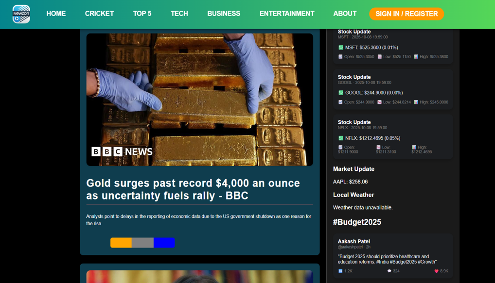
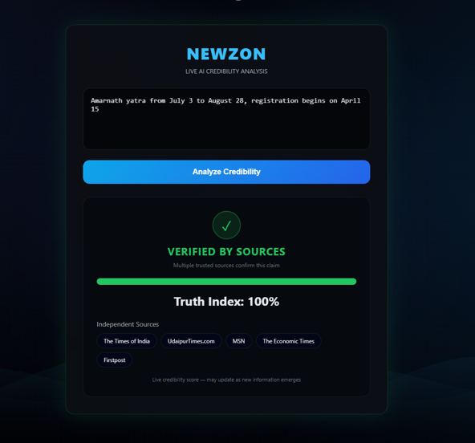

# NEWZON – Full-Stack News Aggregation Platform

NEWZON is a full-stack news aggregation platform that analyzes political bias,
article credibility, and content summaries using AI and NLP pipelines.

The project focuses on end-to-end system design, combining data ingestion,
machine learning–based analysis, and frontend visualization to help users
understand bias and reliability in news content.

---

## Key Features

- **News Aggregation**
  - Collects articles from multiple online news sources
  - Normalizes content for downstream NLP processing

- **Political Bias Detection**
  - Uses transformer-based NLP models to classify articles into
    Left / Centre / Right political stances
  - Trained and evaluated on Indian news datasets

- **Article Summarization**
  - Generates concise summaries to improve readability and comparison
  - Designed for fast consumption of long-form articles

- **Credibility & Misinformation Signals**
  - Applies source-based heuristics and validation logic
  - Produces a credibility indicator rather than a binary label

- **AI Reel Module (Experimental)**
  - Transcribes audio/video content
  - Labels segments using NLP-based classification
  - Explores applying bias and topic detection to non-text media

---

## Design Focus

NEWZON was built as a **systems-oriented project**, emphasizing:

- End-to-end pipeline design (ingestion → analysis → presentation)
- Clear separation between frontend, backend, and ML components
- Practical handling of noisy, real-world news data
- Explainable outputs rather than black-box predictions

---

## Deployment Note

Due to the project’s scope—including live news ingestion, external API
dependencies, and ML pipelines—NEWZON is presented as a **GitHub-based
implementation** rather than a continuously deployed service.

The repository contains the complete backend logic, ML workflows,
and frontend implementation for reproducibility and review.

---

## Project Status

- Core bias detection and aggregation pipelines: **Complete**
- Summarization and credibility workflows: **Functional**
- AI Reel module: **Experimental / exploratory**

---

---

## Website Preview

The following screenshots demonstrate the user interface and major workflows
of the NEWZON platform.

### Home Dashboard

  

---

### Article Analysis

  

---

### Bias Visualization

  

---

### News Details

  

---

### AI Reel Module (Experimental)

  

